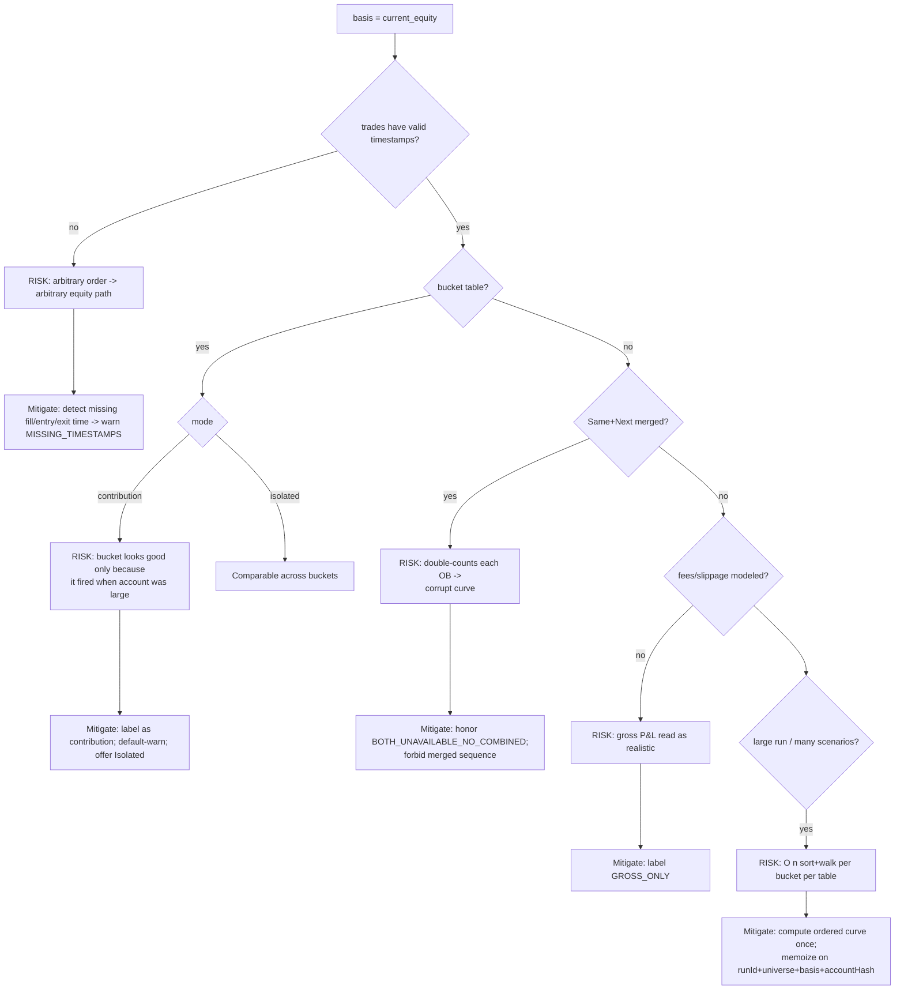
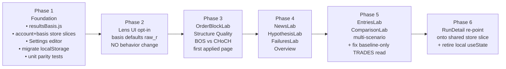

# Results Basis — Implementation Roadmap & Architecture Design

**Mode:** AUDIT + DESIGN ONLY. No implementation, no code changes.
**Date:** 2026-05-29
**Predecessor:** `RESULTS_BASIS_SCENARIO_ANALYTICS_AUDIT.md`
**Purpose:** Turn the audit findings into a concrete, ordered implementation roadmap and a target architecture.

---

## 0. Framing

Two orthogonal axes describe every analytical number in the app:

| Axis | Question | Owned by | Status today |
|---|---|---|---|
| **Trade Universe** | *Which trades am I looking at?* | `state.scenario` → `getTradeUniverse()` → `universe.trades` | Built, mostly adopted |
| **Results Basis** | *How am I measuring them?* | *(does not exist yet)* | Raw R hard-coded everywhere; Current Equity siloed in RunDetail |

The roadmap's job is to give **Results Basis** the same first-class, store-backed, app-wide treatment that **Trade Universe** already has — and to collapse the three competing calculators into one.

Confirmed store facts this design builds on:
- Module-level `state` object; `notify()` fans out to a `Set` of `listeners`; `useDataset()` subscribes via `useState`/`useEffect`.
- Setters follow a fixed shape: `state = {...state, slice:{...}}; persistX(); notify();` (e.g. `setScenario(patch)`).
- Persistence is per-slice localStorage keys (`fxob_scenario_v1`, `fxob_active_run_id`, …).
- Derived snapshot is exposed through `buildDerived()` (e.g. `SCENARIO`, `getTradeUniverse`).
- RunDetail account settings already exist but live in component `useState` + `localStorage('fxob_account_view_settings_v1')`, isolated from the store.

---

## 1. The Ideal `resultsBasis.js` API

### 1.1 Design principles

1. **Pure & framework-free** — no React, no store import. Same posture as `accountEquity.js` and `tradeClassification.js`, so it is trivially testable and callable from anywhere (store, hooks, web workers).
2. **One entry point** — every surface gets its roll-up from a single function. The basis is a *parameter*, not a fork in caller code.
3. **Superset return shape** — always return the Raw-R fields; add the currency/account fields only when basis is `current_equity`. Callers that only render Raw R keep working untouched.
4. **Sequence-awareness is internal** — callers pass an unordered trade list; the module orders it (for Current Equity) using the existing `accountEquity` chronological sort. Callers never sort.
5. **Delegation, not reimplementation** — Raw R routes through the existing `summarizeTradeSanity` math; Current Equity routes through `accountEquity.js`. `resultsBasis.js` is an *orchestrator + contribution layer*, not a fourth copy of the formulas.

### 1.2 Core API surface

```
// ── Types ────────────────────────────────────────────────
Basis        = "raw_r" | "current_equity"
BucketMode   = "contribution" | "isolated"        // only meaningful for current_equity
AccountConfig = {                                  // = normalizeAccountSettings output
  mode: "r_only"|"fixed_dollar"|"initial_equity_pct"|"current_equity_pct",
  startingBalance, fixedRiskAmount, riskPct, currency
}

// ── 1. The single roll-up everyone calls ─────────────────
summarizeTrades(trades, {
  basis,                 // default "raw_r"
  account,               // required when basis === "current_equity"
  winRateDenominator,    // passthrough to existing tradeClassification option
}) -> ResultSummary

// ── 2. Bucket breakdowns (BOS vs CHoCH, session, OB quality…) ─
summarizeBuckets(trades, {
  keyOf,                 // (trade) => bucketKey   — caller supplies grouping fn
  basis,
  account,
  bucketMode,            // "contribution" | "isolated"  (current_equity only)
}) -> Map<bucketKey, BucketSummary>

// ── 3. Equity curve (RunDetail, EntriesLab, Failures equity) ──
buildCurve(trades, { basis, account }) -> CurvePoint[]

// ── 4. Helpers ───────────────────────────────────────────
describeBasis(basis, account) -> "Raw R" | "Current Equity · $10,000 · 1%/curr"
isSequenceDependent(basis) -> boolean        // true only for current_equity
```

### 1.3 Return shapes

```
ResultSummary {
  basis,                        // echoed back for badge rendering
  count, wins, losses,
  // ── always present (Raw-R view, even under current_equity) ──
  netR, expectancy, winRate, profitFactor, maxDrawdownR,
  // ── present only when basis === "current_equity" ──
  netAmount, expectancyAmount,
  maxDrawdownAmount, maxDrawdownPct,
  startingBalance, endingBalance, currency,
  sequenceUsed: true,           // signals ordering was applied
  warnings: Warning[],          // e.g. MISSING_TIMESTAMPS, GROSS_ONLY
}

BucketSummary extends ResultSummary {
  bucketKey,
  bucketMode,                   // "contribution" | "isolated" | null(raw)
  // contribution mode adds:
  contributionAmount,           // Σ currency P&L of this bucket within full sequence
  contributionPctOfNet,         // share of total account net
  // isolated mode adds:
  isolatedEndingBalance,        // re-run engine on this bucket alone from start
}
```

### 1.4 Why these three functions (and not more)

```
                    ┌───────────────────────┐
   trades ───────▶  │   summarizeTrades()   │ ───▶  KPI strips, headline cards
                    └───────────────────────┘
                    ┌───────────────────────┐
   trades ───────▶  │   summarizeBuckets()  │ ───▶  every breakdown table
   + keyOf          └───────────────────────┘       (BOS/CHoCH, session, OB-quality…)
                    ┌───────────────────────┐
   trades ───────▶  │     buildCurve()      │ ───▶  equity charts
                    └───────────────────────┘
```

Three functions cover 100% of the surfaces inventoried in the audit. `summarizeBuckets` is the one genuinely new capability — it is what lets a bucket table honor Current Equity *correctly* (contribution from the ordered curve) instead of naively re-summing isolated subsets.

---

## 2. Moving Account Settings into Global Architecture

### 2.1 Where it lives today vs target

```
TODAY                                  TARGET
─────                                  ──────
RunDetail.jsx                          data/store.js
  useState(loadAccountViewSettings)      state.accountSettings   ← single source
  localStorage 'fxob_account_view_         setAccountSettings(patch)
    settings_v1'                           persistAccountSettings()  → 'fxob_account_settings_v1'
  (invisible to every other page)        buildDerived(): ACCOUNT_SETTINGS, RESULTS_BASIS
                                         Settings.jsx  ← edits the store slice
                                         resultsBasis.js ← receives account as a param
```

### 2.2 Recommended home: **Store (canonical) + Settings page (editor) — a combination, not Context**

| Option | Verdict | Reasoning |
|---|---|---|
| **Settings page only** | ✗ | It's an *editor*, not a home. The value must be readable by the store/hooks at calculation time, not just on a settings screen. |
| **React Context** | ✗ | Redundant with the existing store, which already is an app-wide observable singleton with persistence. Adding Context would create a second source of truth and a provider-tree dependency the rest of the app doesn't use. The app's established pattern is the store. |
| **Store (canonical)** | ✓ core | Mirrors `state.scenario` exactly: persisted slice, `setAccountSettings(patch)`, exposed via `buildDerived`, reactive through `useDataset`. Calculators read it as a plain value. |
| **Settings page (editor surface)** | ✓ companion | Add an "Account & Results Basis" section that calls `setAccountSettings` / `setResultsBasis`. RunDetail's existing account form becomes a thin shared component pointed at the same store slice. |

**Decision: Store + Settings page.** The store is the single source of truth; the Settings page (and the lifted RunDetail form) are editors. No new Context.

### 2.3 New store slices (following the `setScenario` template exactly)

```
state.accountSettings = normalizeAccountSettings(load 'fxob_account_settings_v1')
state.resultsBasis    = load 'fxob_results_basis_v1'  || "raw_r"

setAccountSettings(patch) { state = {...state, accountSettings: normalize({...state.accountSettings, ...patch})};
                            persistAccountSettings(); notify(); }
setResultsBasis(basis)    { state = {...state, resultsBasis: basis};
                            persistResultsBasis(); notify(); }

buildDerived(): { ..., ACCOUNT_SETTINGS, RESULTS_BASIS }
```

### 2.4 Migration of the existing localStorage key

`fxob_account_view_settings_v1` (RunDetail) → on first load, if the new key `fxob_account_settings_v1` is absent, read the old key, `normalizeAccountSettings`, write the new key. One-time, non-destructive. RunDetail then reads from the store instead of its own `useState`.

---

## 3. Surfacing Results Basis in the UI

### 3.1 The Lens — global control

```
┌──────────────────────────────────────────────────────────────────────────┐
│ ⌕ LENS    Universe: [ Triggered Edge 25% · Next ▾ ]   Basis: [ Raw R ▾ ]   │
│                                              └ when "Current Equity":       │
│                                                [ $10,000 · 1% current ⚙ ]   │
└──────────────────────────────────────────────────────────────────────────┘
```

- Universe select = existing scenario selector (`buildAvailableOptions`).
- Basis select = `Raw R` / `Current Equity`. Selecting Current Equity reveals an account chip that opens the shared account form (the lifted RunDetail form).
- Both write to the store; both persist; both reactive via `useDataset`.

### 3.2 Per-table chrome (driven off the summary + universe warnings)

```
┌─ Structure Quality ─────────────────────────────  [ Baseline · Raw R ] ──┐   ← scope badge
│  BOS    n=120   WR 58%   +34.2R   Exp +0.28R   PF 1.6                      │
│  CHoCH  n= 80   WR 51%   +12.1R   Exp +0.15R   PF 1.2                      │
│  ⚠ Baseline data only — does not reflect the Triggered Edge universe.      │   ← warning row
└────────────────────────────────────────────────────────────────────────┘
```

Every analytics card header carries a **scope badge** = `{universe.label} · {describeBasis(basis)}`. Reuse the existing `TradeUniverseBadge`; append a basis segment.

---

## 4. Global vs Page-Level Overrides

### 4.1 Resolution order (precedence)

```
        ┌─────────────────────────────────────────────┐
        │ effective = pageOverride ?? globalLens       │
        └─────────────────────────────────────────────┘
                 ▲                         ▲
        page-local segmented        store.resultsBasis
        control (optional)          store.scenario
```

A small `useResultsLens(pageOverride?)` hook resolves: if a page passed an override (or the user flipped a local segmented control), use it; else fall back to the global store value. Mirrors how `useTradeUniverse(runId, scenarioOverride)` already accepts an override.

### 4.2 Page classification

| Page class | Universe axis | Basis axis | Examples |
|---|---|---|---|
| **Single-universe analytics** | follows global lens | follows global lens, local override allowed | OrderBlockLab, NewsLab, HypothesisLab, FailuresLab, Overview |
| **Multi-scenario by design** | **ignores** global universe (shows many) | honors basis (raw curves vs equity curves) | EntriesLab, ComparisonLab |
| **Run-scoped** | own run/variant, not lens | honors basis | RunDetail (already current-equity capable) |

**Recommendation:** global lens as the default everywhere, with an opt-in page-level override segmented control. Global solves the stated goal (user shouldn't hold scenarios in their head); the override is the safety valve so a single page experiment can't be lost on navigation, and so multi-scenario pages can diverge intentionally.

---

## 5. Raw R vs Current Equity — Display Conventions

| Concern | Raw R | Current Equity |
|---|---|---|
| Unit suffix | `R` (`+34.2R`) | currency (`+$1,240`, `formatAccountValue`) |
| Expectancy | `+0.28R` per trade | `+$42` per trade |
| Drawdown | `-8.4R` | `-$1,120 (-9.2%)` |
| Win rate / PF | identical in both (count-based, basis-independent) | identical — render once, never recompute per basis |
| Sort default | by `expectancy` or `netR` | by `contributionAmount` |
| Color semantics | sign of R | sign of currency |
| Badge | `Raw R` | `Current Equity · $10k · 1%` |
| Tooltip | "Equal-weight edge; reorder-safe." | "Sequence-dependent; reflects account size at each trade." |

**Rule:** WR and PF are basis-invariant — compute once, show in both. Only money-weighted quantities (netR↔netAmount, expectancy↔expectancyAmount, DD) change with basis. This avoids implying WR somehow differs under compounding.

---

## 6. Contribution vs Isolated Mode

Only relevant when **basis = Current Equity** on a **bucket** table.

```
                         Full ordered sequence (all trades)
                         ●──●──●──●──●──●──●──●──●──●──●──●
CONTRIBUTION (default):  pick the CHoCH trades *in place*, sum their
                         currency P&L as they actually occurred.
                         → "What did CHoCH add to THIS account run?"
                         → depends on what came before (position in sequence)

ISOLATED:                re-run accountEquity on CHoCH trades ALONE,
                         from startingBalance.
                         ●──●──●  (CHoCH only, fresh account)
                         → "If I ONLY traded CHoCH, what would happen?"
                         → independent of other buckets
```

Design:
- **Default = Contribution** (it answers "where did my account growth come from?", the natural Current-Equity question), with a one-line caveat: *"Sequence-dependent account contribution, not isolated edge."*
- **Toggle to Isolated** on the table; Isolated re-runs the engine per bucket from `startingBalance`.
- Both shown only under Current Equity; under Raw R the distinction collapses (Raw R is reorder-safe) so the toggle is hidden.
- For *comparison* questions ("is BOS better than CHoCH?"), nudge users to Raw R or Isolated — Contribution mixes edge with sequence position.

---

## 7. Risks Around Sequence-Dependent Analytics



Summary of the seven risks and their mitigations:

1. **Sequence dependence** — bucket numbers shift if the sequence or filter changes. Always derive contribution from the *one* full ordered curve, never by re-summing subsets.
2. **Contribution ≠ edge** — the dominant misinterpretation risk. Label, default-caveat, offer Isolated.
3. **BOS vs CHoCH under compounding misleads comparison** — steer comparison toward Raw R / Isolated; consider side-by-side Raw-R and Current-Equity columns.
4. **Merged Same+Next** — resolver already forbids; calculator must not bypass.
5. **Missing/ambiguous timestamps** — detect and warn; never silently order arbitrarily.
6. **Gross-only P&L** — no fees/slippage modeled; label until modeled.
7. **Performance** — sort+walk per (universe, account config); memoize once, derive buckets from the cached curve.

---

## 8. Migration Order



### Per-phase exit criteria

| Phase | Scope | Done when |
|---|---|---|
| **1 Foundation** | `resultsBasis.js`, store slices, Settings editor, localStorage migration | Raw-R output byte-identical to today (parity tests green); account config readable from store; nothing visually changed |
| **2 Lens (opt-in)** | Global lens control wired to store | Basis defaults to Raw R; every page renders exactly as before; flipping basis is possible but no page consumes it yet |
| **3 First page** | OrderBlockLab structure-quality panel | Panel routed through `summarizeBuckets`; scope badge + Current-Equity contribution + caveat present; validated against RunDetail account numbers for the same trade set |
| **4 Single-universe rollout** | NewsLab, HypothesisLab, FailuresLab, Overview | Inline math replaced by shared calculator; badges + warnings on each; Raw-R parity preserved |
| **5 Multi-scenario** | EntriesLab, ComparisonLab | Adopt Basis axis; keep multi-universe display; ComparisonLab reads `universe` not raw `TRADES` |
| **6 RunDetail re-point** | RunDetail account view | Reads `state.accountSettings`/`state.resultsBasis`; local `useState` + old localStorage key retired |

**Ordering rationale:** Foundation first (it's the prerequisite that removes the three-calculator hazard). Lens before any consumer so the plumbing is proven inert. One low-blast-radius page (OrderBlockLab structure quality) as the reference implementation. Single-universe pages next because they map 1:1 onto the global lens. Multi-scenario pages last because they intentionally diverge from the global universe and need their own design pass. RunDetail re-point last so its battle-tested current-equity behavior is only touched once the shared slice is proven.

---

## 9. Final Target Architecture

```
                          ┌──────────────────────────────────────────┐
                          │                data/store.js              │
                          │  state.scenario        (Which trades?)    │
                          │  state.resultsBasis    (How measured?)    │
                          │  state.accountSettings (compounding cfg)  │
                          │  setScenario / setResultsBasis /          │
                          │  setAccountSettings  → persist → notify    │
                          └───────────────┬──────────────────────────┘
                                          │ useDataset() / getTradeUniverse()
              ┌───────────────────────────┼───────────────────────────┐
              ▼                            ▼                           ▼
   ┌────────────────────┐     ┌────────────────────────┐   ┌────────────────────┐
   │ useTradeUniverse() │     │   useResultsLens()      │   │  Settings page      │
   │  → universe.trades │     │  → { basis, account,    │   │  + lifted RunDetail │
   │  (scenario-aware)  │     │      bucketMode }       │   │   account form      │
   └─────────┬──────────┘     └────────────┬───────────┘   └────────────────────┘
             │                             │
             └──────────────┬──────────────┘
                            ▼
            ┌──────────────────────────────────────────────┐
            │            analytics/resultsBasis.js          │   ← SINGLE SOURCE OF TRUTH
            │   summarizeTrades · summarizeBuckets ·         │
            │   buildCurve · describeBasis                   │
            │   ┌─────────────────┐   ┌──────────────────┐  │
            │   │ raw_r path:      │   │ current_equity:  │  │
            │   │ tradeClassif.    │   │ accountEquity.js │  │
            │   │ summarizeTrade-  │   │ (compounding +   │  │
            │   │ Sanity (routed)  │   │ contribution)    │  │
            │   └─────────────────┘   └──────────────────┘  │
            └───────────────────────┬──────────────────────┘
                                    │ one call site shape everywhere
        ┌───────────────┬───────────┼───────────┬───────────────┬─────────────┐
        ▼               ▼           ▼           ▼               ▼             ▼
   OrderBlockLab     NewsLab   HypothesisLab FailuresLab   EntriesLab*   ComparisonLab*
   (badge+toggle)   (badge)    (badge)       (badge)       (multi-scn)   (multi-scn)
                                                        * honor basis, own universe handling
   RunDetail ── reads same store slices; account view becomes one consumer among many.

   RETIRED:  lib/metrics.js (folded into resultsBasis) ·
             inline per-page R aggregation · RunDetail-local account useState/localStorage.
```

End state in one sentence: **one store owns both axes; one pure module computes every metric in either basis; every page is a thin consumer that declares (Universe, Basis, BucketMode) and renders what it gets back.**

---

## 10. Future Considerations

- **Fees / slippage / commission model** — add as optional `AccountConfig` fields consumed by `accountEquity`; flips the `GROSS_ONLY` warning off. Natural follow-on once Current Equity is trusted.
- **Per-trade variable risk** — today risk is one global rule; future runs may carry per-trade risk; `riskForTrade` would accept a trade-level override.
- **Basis-aware caching in the store** — precompute `universe.stats` for *both* bases on import (keyed by account-config hash) so page loads are instant; invalidate on account-config change.
- **Comparison columns** — a "show both bases side by side" mode for research, making the edge-vs-account-growth gap explicit rather than a hidden toggle.
- **Multi-account profiles** — saved account presets (e.g. "$10k prop", "$100k personal", "FTMO 2-step") selectable from the Lens; the funding-challenge engine already hints at this.
- **Worker offload** — for very large runs / EntriesLab's many scenarios, run `resultsBasis` in a web worker; the pure, framework-free design makes this drop-in.
- **Backend parity** — if any of these roll-ups ever move server-side, the pure module's contract is the spec; keep the JS and any backend implementation behind the same `summarizeTrades` shape.

---

### STOP — design complete. No implementation performed.
