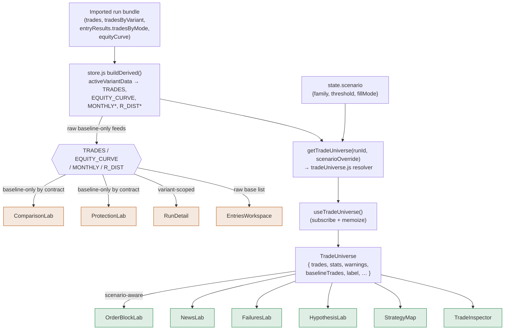
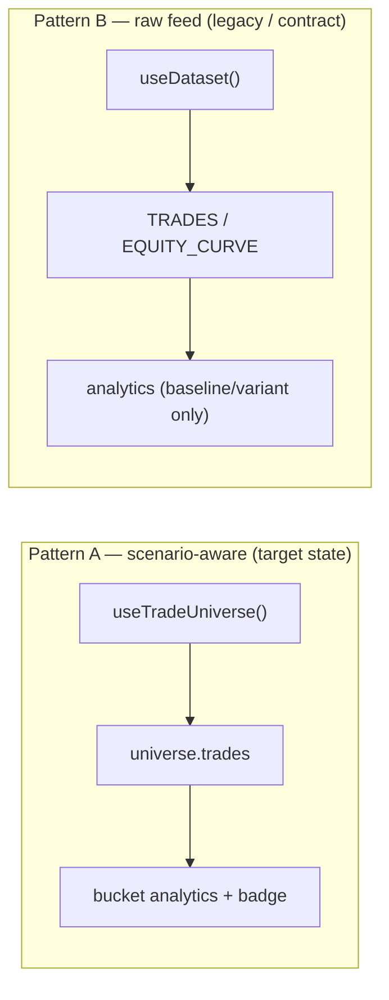
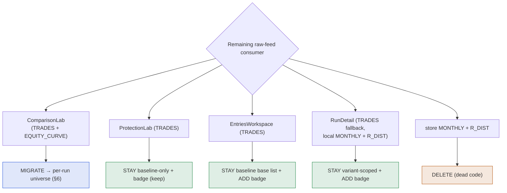
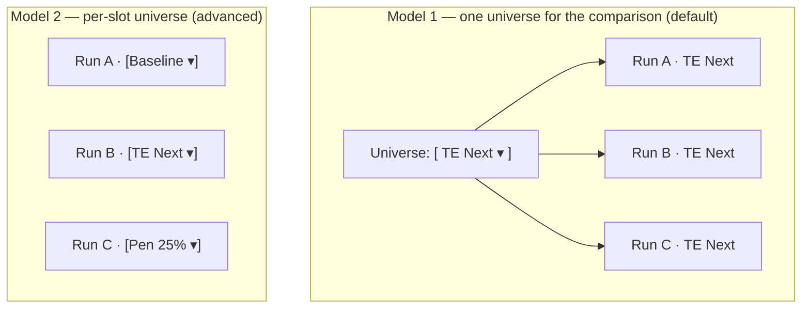
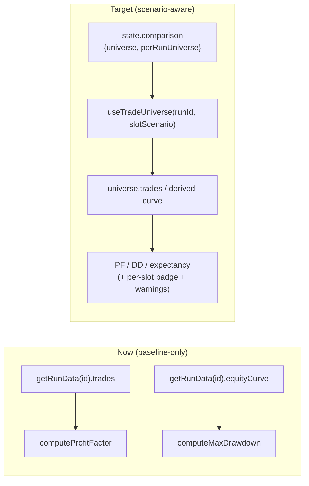
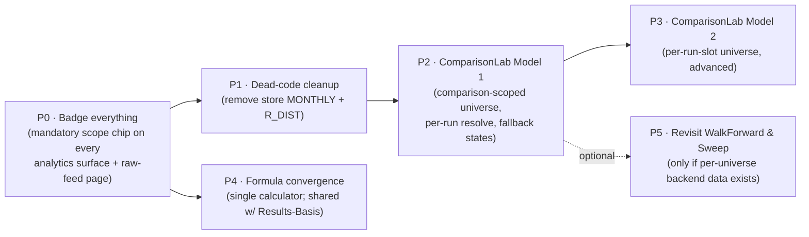

# Scenario-Aware Analytics — Audit & Design

**Mode:** AUDIT + DESIGN ONLY. No files modified. No implementation. No code changes.
**Date:** 2026-05-29
**Scope:** Whether every analytics surface should recalculate against the *active Trade Universe*, an audit of the analytics areas and remaining baseline-only data consumers, and a forward design for scenario support in ComparisonLab.
**Companion doc:** `RESULTS_BASIS_SCENARIO_ANALYTICS_AUDIT.md` (the *Results Basis* — Raw R vs Current Equity — axis). This document is the orthogonal **Trade Universe** axis and reuses that doc's grid model where relevant.

---

## 0. The core question, answered up front

> *Should all analytics surfaces recalculate against the active Trade Universe?*

**No — but the ones that matter already do, and the rest need scope badges, not migration.**

The Trade Universe rollout has already pushed every *edge-research* surface (the bucket/quality analytics) onto `useTradeUniverse()`, so they recompute correctly per universe today. What remains baseline-only falls into three buckets, only one of which should migrate:

1. **Edge-research surfaces** — Structural, Session, News, OB, Validation (statistical), Failure, and all bucketed expectancy tables. **Already scenario-aware. Keep.**
2. **Comparison/contract surfaces** — ComparisonLab, ProtectionLab. **Intentionally baseline-only as a design contract.** ComparisonLab *should* gain scenario support (that is the ComparisonLab design in §4); ProtectionLab should stay baseline-only with its badge.
3. **Non-trade-derived or execution surfaces** — SweepLab (parameter sweeps), WalkForwardLab (run folds), RunDetail (single-run execution view), and the dead store-level `MONTHLY`/`R_DIST`. **These should not become scenario-aware**; some are conceptually a different axis, one pair is dead code.

The strategic shift Jack asked for — from *"Is BOS good?"* to *"Under which Trade Universe is BOS good?"* — is **already structurally true** in the labs. The remaining work is (a) closing the two contract gaps (ComparisonLab), (b) making the active universe *unmistakable* on every surface via a mandatory scope badge, and (c) retiring dead derived state. This is a finishing pass, not a rebuild.

---

## 1. Files read

Data / resolver layer:

- `frontend/src/data/store.js` — derived feeds (`TRADES`, `EQUITY_CURVE`, `MONTHLY`, `R_DIST`), `getTradeUniverse(runId, scenarioOverride)`, `state.scenario`.
- `frontend/src/data/tradeUniverse.js` — resolver, `familyFromKey`, `thresholdToKeyPart`, `fillModeFromKey`, `buildAvailableOptions`, canonical keys, warnings.
- `frontend/src/data/useTradeUniverse.js` — the canonical hook.
- `frontend/src/data/tradeClassification.js` — `summarizeTradeSanity` (raw-R roll-up surfaced as `universe.stats`).
- `frontend/src/lib/metrics.js` — `computeProfitFactor`, `computeMaxDrawdown` (used by ComparisonLab).
- `frontend/src/components/lab/TradeUniverseBadge.jsx` — shared scope chip.

Analytics surfaces:

- `pages/OrderBlockLab.jsx` (structure / session / OB-quality / news-OB / penetration / CI-validation / bucket drill), `pages/NewsLab.jsx`, `pages/FailuresLab.jsx` + `components/lab/failures/FailuresWorkspace.jsx`, `pages/HypothesisLab.jsx`, `pages/SweepLab.jsx`, `pages/WalkForwardLab.jsx`, `pages/EntriesLab.jsx` + `components/lab/entries/EntriesWorkspace.jsx`, `pages/ProtectionLab.jsx`, `pages/ComparisonLab.jsx`, `pages/RunDetail.jsx`, `pages/StrategyMap.jsx`.

---

## 2. Conceptual model — Trade Universe as a first-class axis

A Trade Universe is a *named, resolved trade set* for a run. The resolver (`getTradeUniverse`) already encodes the full family/threshold/fillMode model, so the universes in the brief are all first-class today:

```
family          threshold       fillMode        sourceKey
─────────────────────────────────────────────────────────────────────
baseline        —               —               baseline
triggered_edge  {10,25,50,75}   same | next      entry_triggered_edge_25p0_same
penetration     {10,25,50,75}   —                entry_penetration_25p0
```

The brief's examples map cleanly onto this:

| Brief label              | family          | threshold | fillMode |
|--------------------------|-----------------|-----------|----------|
| Baseline                 | baseline        | —         | —        |
| Triggered Edge Same      | triggered_edge  | (chosen)  | same     |
| Triggered Edge Next      | triggered_edge  | (chosen)  | next     |
| Penetration 10%          | penetration     | 10        | —        |
| Penetration 25%          | penetration     | 25        | —        |
| Penetration 50%          | penetration     | 50        | —        |
| Penetration 75%          | penetration     | 75        | —        |

**Do analytics change significantly across universes?** Structurally, yes — and unavoidably. Each universe is a *different trade set* (different fills, often different trade counts; Same vs Next can differ trade-by-trade). So any bucket breakdown — BOS vs CHoCH win rate, London-session expectancy, news-OB invalidation — is computed over a different population in each universe and *will* produce different numbers. That is exactly why the active universe must be both (a) the input to the calculation and (b) visible on the surface. The danger is never "the numbers differ"; it is "the numbers differ and the user thinks they're still looking at Baseline."

### The grid every metric lives in

A metric is only fully specified by **(Trade Universe × Results Basis)** — this document owns the first axis, the companion doc owns the second:

```
                    Raw R (this app's default)        Current Equity (companion doc)
Baseline            edge of baseline                  account growth on baseline seq
Triggered Edge Same edge of TE-same                   account growth on TE-same seq
Triggered Edge Next edge of TE-next                   account growth on TE-next seq
Penetration 25%     edge of pen-25                    account growth on pen-25 seq
…                   …                                 …
```

---

## 3. Current architecture (as-built)

### 3.1 Data flow



`*` store-level `MONTHLY` / `R_DIST` are computed but have **no consumers** — see §5.

### 3.2 Two consumption patterns coexist



The Trade Universe rollout migrated the edge-research labs to Pattern A. Every surface still on Pattern B is either an intentional contract (ComparisonLab, ProtectionLab), a non-trade axis (SweepLab, WalkForwardLab), a single-run execution view (RunDetail), or dead code.

---

## 4. Part 1 — Analytics surface audit

For each area: *Is it scenario-aware? Is it baseline-only? Should it be scenario-aware? What breaks if migrated? Product recommendation.*

### Summary matrix

| # | Area | Surface(s) | Trade source | Scenario-aware now? | Baseline-only? | Should be scenario-aware? |
|---|------|-----------|--------------|---------------------|----------------|---------------------------|
| 1 | Structural Quality (BOS vs CHoCH) | OrderBlockLab `structureRows` | `universe.trades` | **Yes** | No | Yes — keep |
| 2 | Session Quality | OrderBlockLab origin/fill session + session matrix | `universe.trades` | **Yes** | No | Yes — keep |
| 3 | News Quality | NewsLab + OrderBlockLab news-OB panels | `universe.trades` | **Yes** | No | Yes — keep |
| 4 | OB Quality | OrderBlockLab width/age/penetration/creation-hour | `universe.trades` | **Yes** | No | Yes — keep |
| 5 | Sweep Quality | SweepLab `SWEEP_*` | own parameter-sweep state (not bundle trades) | **No** | n/a (different axis) | **No** — out of scope |
| 6 | Validation Quality | (a) OrderBlockLab CI/significance/low-sample · (b) WalkForwardLab OOS | (a) `universe.trades` · (b) `RUNS` folds | (a) **Yes** · (b) **No** | (b) run-level | (a) keep · (b) no |
| 7 | Failure Analytics | FailuresLab / FailuresWorkspace | `universe.trades` | **Yes** | No | Yes — keep |
| 8 | Bucketed expectancy tables | OrderBlockLab `bucketRows` + drill, NewsLab, HypothesisLab | `universe.trades` | **Yes** | No | Yes — keep |

### 1. Structural Quality — BOS vs CHoCH

- **Scenario-aware now?** Yes. `OrderBlockLab.jsx` resolves `universe = useTradeUniverse()` then `trades = universe.trades` (L85/L110), and `structureRows` is built via `bucketRows(trades, t => t.structure, ["BOS","CHoCH","Limited Data"])` (L1262). The cumulative-R BOS/CHoCH/All chart (L1607) reads the same `trades`.
- **Baseline-only?** No.
- **Should it be?** Yes — this is the canonical example. BOS vs CHoCH is a property of a specific trade set; Same vs Next and each penetration depth genuinely change which structure each fill belongs to.
- **What would break if migrated?** Nothing — already migrated. The only residual risk is the **bucket drill modal** (`BucketDrillModal`, L1089) recomputing `netR/exp/wr` inline; it operates on the `trades` passed into it, so it stays correct *as long as it is always fed `universe.trades`* (it is). Flagged only because it is a 4th inline copy of the expectancy formula (see Risk R4).
- **Recommendation:** Keep. Add the mandatory scope badge to the panel header (it already renders a page-level `TradeUniverseBadge`; make the per-panel chip explicit so a screenshotted panel is self-describing).

### 2. Session Quality

- **Scenario-aware now?** Yes. Origin-session, creation-hour, day-of-week, and the Origin×Fill session matrix all derive from `universe.trades`.
- **Baseline-only?** No.
- **Should it be?** Yes. Session edge can invert between Same and Next (a fill that lands one candle later can cross a session boundary), so per-universe recomputation is essential.
- **What breaks if migrated?** Already done. Watch low-sample fragmentation: splitting by session *and* universe thins each cell — the existing low-sample machinery (R6 below) covers this.
- **Recommendation:** Keep. Ensure the session matrix honors `universe.warnings` so an empty cell under a sparse universe reads as "no data for this universe," not "0R edge."

### 3. News Quality

- **Scenario-aware now?** Yes. `NewsLab.jsx` uses `universe.trades` (L50/L51) and passes `universe` to its badge. OrderBlockLab's news-created-OB population/lifecycle/invalidation panels read the same universe trades.
- **Baseline-only?** No.
- **Should it be?** Yes. News-created OBs are a sub-population; their fill behavior differs by universe just like any other.
- **What breaks if migrated?** Already migrated. News data depends on the news ingestion sidecar being present; that is orthogonal to universe selection and already handled via empty-state UI.
- **Recommendation:** Keep.

### 4. OB Quality

- **Scenario-aware now?** Yes. Width, age/time-to-fill, penetration depth, creation-hour, fast-stopout, distance-before-fill — all built from `universe.trades`.
- **Baseline-only?** No.
- **Should it be?** Yes.
- **What breaks if migrated?** Already migrated. One subtlety: the **OB *population* panels** (the "Data Quality · OB Field Completeness" and news/normal OB population summaries) describe the *order-block inventory* (`runData.orderBlocks`), which is a property of the run, not of the trade universe. Those are correctly run-scoped and should **not** be forced onto the universe — an OB exists whether or not a given universe filled it. Keep population panels run-scoped; keep *performance* panels universe-scoped. Label the distinction.
- **Recommendation:** Keep. Make explicit in UI which OB panels are "inventory" (run-scoped) vs "performance" (universe-scoped).

### 5. Sweep Quality

- **Scenario-aware now?** No. `SweepLab.jsx` reads `SWEEP_RR`, `SWEEP_STOP_BUFFER`, `SWEEP_HEATMAP`, etc. from `useDataset()`; the store comment is explicit: *"sweep data is not stored in bundles; SweepLab owns its own state."*
- **Baseline-only?** Not exactly — it is a **different axis entirely**. A sweep varies a *strategy parameter* (RR, stop buffer, verify ticks, timeframe) across re-runs. A Trade Universe varies the *fill rule* within one run. You cannot resolve a sweep "under Triggered Edge Next" from the current bundle, because each sweep point is its own backtest with its own parameters; there is no per-universe trade list to recompute against.
- **Should it be scenario-aware?** **No** — not from current data. The honest answer is that "Sweep under TE Next" would require re-running the entire parameter sweep with the TE-Next fill rule applied, i.e. a backend/exporter concern, not a frontend recompute. Forcing the universe onto SweepLab today would silently show baseline sweep results under a non-baseline badge — the worst outcome.
- **What would break if migrated?** Everything and nothing: there is no universe-scoped sweep data to read, so a "migration" would either no-op or fabricate. Both are bad.
- **Recommendation:** Leave SweepLab on its own state. Add a **"Parameter sweep · baseline run"** scope badge so it is clear this surface is *not* governed by the active universe. If per-universe sweeps are ever wanted, that is a backend feature (export sweep grids per fill-mode), tracked separately.

### 6. Validation Quality

This area splits into two genuinely different things; treat them separately.

**(a) Statistical validation — 95% CI, significance, low-sample flags (OrderBlockLab).**
- **Scenario-aware now?** Yes. `CICell` significance (`lo > 0 || hi < 0`), `lowSampleBuckets` (count of buckets with `0 < count < LOW_SAMPLE_N`, L1286), and `weakConfidence` (L1216) are all computed over the same `universe.trades`-derived bucket rows.
- **Should it be?** Yes — and critically so. A bucket that is significant under Baseline (large n) can become non-significant under Penetration 75% (thin n). That *is* the validation signal. Recomputing CIs per universe is exactly right.
- **What breaks if migrated?** Already migrated. Watch: as universes thin the sample, more buckets trip low-sample — that is correct behavior, not a regression.
- **Recommendation:** Keep. Surface the *baseline-vs-active n* delta so the user sees *why* significance changed across universes.

**(b) Out-of-sample validation — WalkForwardLab.**
- **Scenario-aware now?** No. `WalkForwardLab.jsx` reads `RUNS` and treats imported runs as sequential OOS folds; it operates at the *run* level, not the trade level.
- **Should it be?** No, by current design — folds are whole runs. A coherent "scenario-aware walk-forward" would require each fold-run to be re-resolved under the chosen universe, which is a larger design (per-fold universe selection) and only meaningful once ComparisonLab's per-run scenario model (§6) exists.
- **What breaks if migrated?** It has no `universe.trades` input today; migration is not a small recompute.
- **Recommendation:** Keep run-scoped for now. Badge it "Run-level · folds use each run's primary variant." Revisit only after §6 lands, since it would reuse the same per-run scenario primitive.

### 7. Failure Analytics

- **Scenario-aware now?** Yes. `FailuresWorkspace.jsx` resolves `universe = useTradeUniverse()` and `trades = universe.trades`; the in-file comment confirms the legacy baseline-only `resolveActiveTrades` fallback chain was *removed* in Phase 2C. Losers, archetypes, severity, sessions, streaks, temporal, prevention all flow from universe trades.
- **Baseline-only?** No.
- **Should it be?** Yes. Failure archetypes shift with fill rule (e.g. "fast stopout" frequency changes Same→Next).
- **What breaks if migrated?** Already migrated. Prevention-engine "confidence" tiers depend on sample size and so will move with universe — correct, but worth a tooltip noting confidence is per-universe.
- **Recommendation:** Keep. Carry the universe label into any exported prevention rules (the exporter should stamp the universe so an exported "rule" is not silently misattributed to Baseline).

### 8. Bucketed expectancy tables (any)

- **Scenario-aware now?** Yes. The shared `bucketRows` builder in OrderBlockLab, the news/hypothesis bucket rows, and the bucket drill modal all consume `universe.trades`.
- **Baseline-only?** No.
- **Should it be?** Yes — by definition; a bucket's expectancy is a property of its universe's trade set.
- **What breaks if migrated?** Already migrated. The real debt is **formula duplication**: expectancy/winRate/netR is implemented inline in `bucketRows`, again in `BucketDrillModal`, again per-bucket in NewsLab/HypothesisLab, plus `summarizeTradeSanity` and `lib/metrics.js`. None of these is *wrong* on the universe axis, but the duplication is the thing that will eventually cause two surfaces to disagree (see Risk R4 and the companion doc's §3 "three formula copies" finding).
- **Recommendation:** Keep scenario-awareness; converge the formulas onto one calculator as debt-paydown (shared with the Results-Basis effort — same root cause, do it once).

---

## 5. Part 2 — Remaining Trade Universe consumer audit

These are the surfaces still reading the raw store feeds (`TRADES`, `EQUITY_CURVE`, `MONTHLY`, `R_DIST`) rather than `useTradeUniverse()`. For each consumer: *intentional? should migrate? stay baseline-only? needs a scope badge?*

### Where the feeds come from

`store.js buildDerived()` exposes, for the active run/variant:
- `TRADES = activeVariantData.trades`
- `EQUITY_CURVE = activeVariantData.equityCurve`
- `MONTHLY = computeMonthly(activeTrades)`
- `R_DIST = computeRDist(activeTrades)`

### 5.1 Remaining `TRADES` consumers

| Consumer | Line | Intentional? | Should migrate? | Stay baseline-only? | Needs scope badge? |
|---|---|---|---|---|---|
| **ComparisonLab** | L34 (`TRADES`), L63 `computeProfitFactor(TRADES)` | Yes — Phase 3B-3 contract (baseline-only) | **Yes — via §6 design** | No (it is the target of the scenario work) | Already pins a baseline badge; upgrade to per-run badges |
| **ProtectionLab** | L85–86 | Yes — Phase 3B-2 contract | **No** | **Yes** | Already has baseline badge; keep |
| **EntriesWorkspace** | L44–45 | Partially — uses raw `TRADES` as the *base list* for filters/exact rows while comparing entry **models** via `tradesByMode` | Nuanced — see note | Base list can stay baseline; model comparison is its own axis | **Yes — currently missing** |
| **RunDetail** | L352 (`isActiveRun ? TRADES : null`) | Yes — *fallback only*; primary source is `tradesForRun` (the selected variant) | **No** | **Yes** (variant-scoped execution view) | Yes — "Variant · {name}" badge |

Notes:
- **EntriesWorkspace** is the one genuinely ambiguous case. It reads baseline `TRADES` for the global session/direction filters and the "exact rows," then compares entry *models* (`tradesByMode`) side-by-side. Entry-model is effectively *its own* multi-universe axis (it is where Triggered Edge / Penetration models are born). It is **not wrong** for the base list to be baseline, but the page has **no scope badge**, so a user can't tell that the left-hand base table is baseline while the model table spans models. Recommendation: add a scope badge clarifying "base list = baseline; model columns = per-entry-model," and decide deliberately whether the base list should follow the active universe (low value — the page's purpose is cross-model comparison, so baseline as a fixed reference is defensible).
- **RunDetail**'s `TRADES` is purely a fallback for the active run when `runData` is absent; the real source is `tradesForRun` (selected variant). It is a single-run execution view and should remain variant-scoped, but it needs a badge so users don't read its KPIs as the active *scenario*.

### 5.2 Remaining `EQUITY_CURVE` consumers

| Consumer | Line | Intentional? | Should migrate? | Stay baseline-only? | Needs scope badge? |
|---|---|---|---|---|---|
| **ComparisonLab** | L64, L83, L99 | Yes — Phase 3B-3 contract | **Yes — via §6** | No | Upgrade to per-run badges |

`EQUITY_CURVE` has **exactly one** live consumer outside the store: ComparisonLab. Once ComparisonLab gains per-run universe resolution (§6), the store-level `EQUITY_CURVE` feed has no remaining direct readers and can be reconsidered (it is harmless to keep, but it is no longer load-bearing).

### 5.3 Remaining `MONTHLY` consumers

| Consumer | Line | Intentional? | Should migrate? | Stay baseline-only? | Needs scope badge? |
|---|---|---|---|---|---|
| **store-level `MONTHLY`** | store.js L950 | **No — DEAD** | n/a | n/a | n/a |
| **RunDetail (local `MONTHLY`)** | RunDetail L654 | Yes — recomputed locally from `tradesForRun` | No | **Yes** (variant-scoped) | Yes — inherits RunDetail's variant badge |

**Finding:** `store.MONTHLY` (`computeMonthly(activeTrades)`) has **no consumers** — a grep for `.MONTHLY` / `MONTHLY,` outside `store.js` returns nothing. RunDetail computes its *own* `MONTHLY` from `tradesForRun`. The store-level feed is **dead derived state**. Recommendation: schedule it for removal (cleanup, not migration). RunDetail's local monthly is variant-scoped and fine; it just inherits the page-level scope badge.

### 5.4 Remaining `R_DIST` consumers

| Consumer | Line | Intentional? | Should migrate? | Stay baseline-only? | Needs scope badge? |
|---|---|---|---|---|---|
| **store-level `R_DIST`** | store.js L951 | **No — DEAD** | n/a | n/a | n/a |
| **RunDetail (`R_DIST_V2`)** | RunDetail L860 | Yes — recomputed locally from `tradesForRun` | No | **Yes** (variant-scoped) | Yes — inherits RunDetail's variant badge |

**Finding:** identical to MONTHLY. `store.R_DIST` (`computeRDist(activeTrades)`) has **no consumers**; RunDetail builds `R_DIST_V2` from `tradesForRun`. Store-level `R_DIST` is **dead derived state** — remove. RunDetail's `R_DIST_V2` is variant-scoped and fine under the page badge.

### 5.5 Consumer-audit takeaways



Net: **1 surface to migrate (ComparisonLab), 3 to badge-and-keep, 1 pair of dead feeds to delete.** The "should everything recalculate against the active universe?" answer in concrete terms: *one* surface should, the rest just need to *declare their scope*.

---

## 6. Part 3 — ComparisonLab scenario support (forward design)

### 6.1 The requirement

Today ComparisonLab pins `BASELINE_SCENARIO_OVERRIDE` and compares each run's primary variant via `getRunData(r.id).trades` / `.equityCurve`. The brief wants:

```
   Run A Baseline   vs   Run B Baseline
                versus
   Run A TE Next    vs   Run B TE Next
```

i.e. the user picks a **universe** and the page compares the *same universe across runs*, and can flip the universe for the whole comparison (or, more powerfully, set it per run).

### 6.2 The key enabling fact

The resolver **already supports per-run, per-scenario resolution**: `getTradeUniverse(runId, scenarioOverride)` and the hook `useTradeUniverse(runId, scenarioOverride)` both take a run id *and* a scenario override. ComparisonLab already uses this primitive (it calls `useTradeUniverse(null, BASELINE_SCENARIO_OVERRIDE)` purely to drive its badge). **So the engine to resolve "Run A under TE Next" exists.** What's missing is (a) comparison-scoped scenario *state* (the global `state.scenario` is the wrong scope for a multi-run page) and (b) the UX to drive it.

### 6.3 Two UX models

**Model 1 — single comparison-level universe selector (recommended default).** One selector at the top of ComparisonLab sets the universe for *all* run slots. "Show me every run under Triggered Edge Next." Simple, matches the brief's primary framing, and is the common case.

**Model 2 — per-run-slot universe selector (power mode).** Each run slot gets its own universe dropdown, enabling cross-universe comparisons ("Run A Baseline vs Run B TE Next") for diagnosing whether a fill-rule change explains a difference between runs. More powerful, more rope.

Recommendation: **ship Model 1 first**, with a single "Universe: [Baseline ▾]" control bound to comparison-local state; expose Model 2 as an "advanced / unlock per-run" toggle later. Model 1 satisfies the brief; Model 2 is the natural extension once the data model (below) is in place — and the data model should be built to support Model 2 from day one so Model 1 is just the constrained case.



### 6.4 Recommended UX layout

```
┌────────────────────────────────────────────────────────────────────────┐
│ COMPARISON LAB        Universe: [ Triggered Edge ▾ ] [ 25% ▾ ] [ Next ▾ ]│  ← Model 1 control
│                       (advanced ⚙  per-run universes)                    │
├────────────────────────────────────────────────────────────────────────┤
│  Run A  [select ▾]   ⟨badge: TE 25% · Next · 312 trades⟩                 │
│  Run B  [select ▾]   ⟨badge: TE 25% · Next · 298 trades⟩                 │
│  Run C  [select ▾]   ⟨badge: TE 25% · Next · ⚠ scenario unavailable⟩     │  ← missing-scenario fallback
├────────────────────────────────────────────────────────────────────────┤
│  [ Equity overlay ]  [ Monthly ]  [ PF / DD / Expectancy table ]         │
│  every panel header carries the active universe chip                     │
└────────────────────────────────────────────────────────────────────────┘
```

Behavioral rules:
- **Universe selector reuses `buildAvailableOptions`** so only universes that exist (across the selected runs) are offered.
- **Per-run badge** (existing `TradeUniverseBadge`, non-compact) on each run row, showing the resolved label + trade count + any warning.
- **Missing-scenario fallback (critical):** runs do not all have every scenario CSV. When a run lacks the selected universe, the resolver emits `NO_TRADES_FOR_SCENARIO`. ComparisonLab must render that run's column as an explicit *"scenario unavailable for this run"* state — **never** silently fall back to that run's baseline, because a baseline column sitting in a "TE Next" comparison is a silent lie. Offer an explicit per-run "fall back to baseline" opt-in if the user wants it.
- **"Both" guard:** carry over the resolver's `BOTH_UNAVAILABLE_NO_COMBINED` invariant — never merge Same+Next into a fake combined column.

### 6.5 Required data-model changes

The blocker is **scope of scenario state**, not resolution capability.

1. **Comparison-scoped scenario state.** Add a comparison-local scenario selection (and, for Model 2, a per-slot map `{ [runId]: scenario }`) — *not* on global `state.scenario`. Global scenario is owned by Strategy Map and drives the single-universe labs; ComparisonLab needs its own. Options, in increasing weight:
   - **(a)** Local component state in ComparisonLab (`useState`) — fastest, lost on navigation.
   - **(b)** A dedicated `state.comparison = { universe, perRunUniverse: {} }` slice in the store, persisted like `fxob_scenario_v1` — survives navigation, shareable, recommended.
2. **Per-run universe resolution.** Replace the direct `getRunData(r.id).trades` / `.equityCurve` reads with `useTradeUniverse(r.id, slotScenario)` per run slot. The hook already memoizes on `(runId, scenarioOverride)`, so N run slots = N memoized resolves. PF/DD/expectancy then route through the universe's trades/curve instead of the raw bundle.
3. **Per-universe equity curve.** Equity overlay currently reads `bundle.equityCurve` (a baseline artifact). Under a non-baseline universe there may be no precomputed curve, so the page must derive a cumulative-R curve from the resolved `universe.trades` (the same `cum += r` walk EntriesLab already uses). Decide explicitly: equity overlay is **Raw-R cumulative** unless/until the Results-Basis work lands (companion doc) — label it as such.
4. **Warnings surfaced per slot.** Thread `universe.warnings` into each run row so `NO_TRADES_FOR_SCENARIO` / `FILL_MODE_COERCED` render as the fallback/coercion states above.



### 6.6 What this unlocks

Once per-run universe resolution exists, the brief's headline becomes a literal feature: a single dropdown turns the whole comparison from "Run A vs Run B (baseline)" into "Run A vs Run B *under TE Next*," and the advanced toggle answers "does the Same→Next fill rule explain why Run A beats Run B?" — moving the page from *"which run is better?"* to *"under which universe is which run better?"*, exactly mirroring the BOS framing shift.

---

## 7. Risks

- **R1 — Silent baseline substitution is the cardinal sin.** Any surface that shows a non-baseline badge while computing baseline numbers is worse than one with no badge. This is the live risk in ComparisonLab's missing-scenario fallback (§6.4) and the reason SweepLab must *not* be force-migrated (§4.5). Rule: if a surface cannot honor the active universe, it must *say so*, never approximate.
- **R2 — Scope ambiguity without badges.** RunDetail (variant), EntriesWorkspace (baseline base list), ProtectionLab (baseline contract) all currently render numbers whose scope is invisible. A user moving between Strategy Map (universe X) and these pages will misread them. Mandatory scope badges are the cheapest, highest-leverage fix in this whole document.
- **R3 — Sample fragmentation across universes.** Splitting buckets by universe thins n; thin universes (e.g. Penetration 75%) will trip more low-sample/CI-not-significant flags. This is *correct* but will look like a regression. Surface the baseline-vs-active n delta so the cause is legible.
- **R4 — Formula duplication.** Expectancy/winRate/netR/PF exist in `summarizeTradeSanity`, `lib/metrics.js`, OrderBlockLab `bucketRows`, `BucketDrillModal`, and per-bucket in NewsLab/HypothesisLab. All are currently consistent on the universe axis, but the duplication is the latent cause of future cross-surface disagreement. Converge onto one calculator (shared work item with the Results-Basis effort).
- **R5 — Two scenario scopes will coexist.** Global `state.scenario` (Strategy Map + labs) and comparison-scoped scenario (new) must not bleed into each other. ComparisonLab already deliberately overrides the global scenario for its badge; the new state slice must preserve that isolation or the labs and the comparison page will fight over one value.
- **R6 — "Both" / merged Same+Next.** The resolver forbids a fake combined list; the comparison equity-curve derivation and any future per-universe curve must not reintroduce it by concatenating Same+Next (double-counts OBs).
- **R7 — Equity overlay basis.** A cumulative-R curve derived from universe trades is Raw-R, not account-equity. If unlabeled, users read it as account growth. Label it; defer true account-equity overlays to the Results-Basis work.
- **R8 — Dead-code removal is not free of risk.** `store.MONTHLY`/`store.R_DIST` look dead by grep, but confirm no dynamic/string access before deleting; treat as a small, tested cleanup, not a blind removal.

---

## 8. Migration roadmap

Ordered by leverage-to-risk. Each phase is independently shippable; none requires the next.



- **P0 — Make scope visible (do first; near-zero risk).** Add a mandatory `TradeUniverseBadge` (or a variant/parameter-scope chip) to *every* analytics panel header and to RunDetail, EntriesWorkspace, SweepLab, WalkForwardLab. This alone resolves R1/R2 for the surfaces that legitimately stay baseline/variant-scoped, and delivers most of the brief's intent ("the user always knows which universe they're reading") without touching a single calculation.
- **P1 — Retire dead derived state.** Remove `store.MONTHLY` and `store.R_DIST` after confirming no dynamic consumers. Pure cleanup; shrinks the "remaining consumer" surface to its real members.
- **P2 — ComparisonLab Model 1.** Add the comparison-scoped scenario slice, swap per-run reads to `useTradeUniverse(runId, slotScenario)`, derive per-universe Raw-R equity curves, implement the missing-scenario fallback state. This is the one real *migration* in the document and the core deliverable of the brief.
- **P3 — ComparisonLab Model 2.** Per-run-slot universe selection (advanced toggle), built on the P2 data model.
- **P4 — Formula convergence (parallelizable with P2/P3).** Route all bucket/expectancy math through one calculator. Shared root cause with the Results-Basis doc — do it once for both axes.
- **P5 — WalkForward / Sweep (conditional).** Only meaningful if the exporter produces per-universe sweep grids / per-fold universe data. Backend-gated; revisit after P2 proves the per-run primitive.

---

## 9. Bottom line

The Trade Universe rollout already accomplished the hard part: every edge-research surface recomputes against the active universe today. The conceptual shift from *"Is BOS good?"* to *"Under which Trade Universe is BOS good?"* is, for the labs, **already real** — what's missing is that the surfaces don't always *announce* which universe they're showing. The finishing work is therefore mostly **declarative** (badge everything — P0), one genuine **migration** (ComparisonLab — P2/P3), and a little **cleanup** (dead feeds — P1). SweepLab and WalkForwardLab are a different axis and should be left alone behind honest badges; ProtectionLab, RunDetail, and EntriesWorkspace's base list have legitimate non-universe scopes and need labels, not migration.

---

### STOP — audit & design complete. No implementation performed. No code changed.
