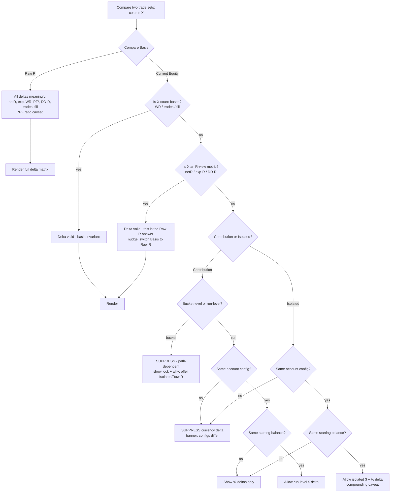

# Table Compare under Results Basis — Delta Meaningfulness Audit

**Mode:** AUDIT + DESIGN ONLY. No implementation, no code changes.
**Date:** 2026-05-29
**Predecessors:** `RESULTS_BASIS_SCENARIO_ANALYTICS_AUDIT.md`, `RESULTS_BASIS_IMPLEMENTATION_ROADMAP.md`
**Question:** How should Table Compare behave under **Raw R**, **Current Equity · Contribution**, and **Current Equity · Isolated** — and which delta calculations stay mathematically meaningful vs. which must be suppressed?

---

## 0. What "Table Compare" Is Today

Table Compare = showing **delta columns** between two (or more) trade sets, per row (per bucket or per entry-model). Three implementations / plans exist:

- `components/lab/entries/compare/EntryDeltaTable.jsx` — cross-run compare. Dims: `netR, expectancy, winRate (pp), profitFactor, fillPct, trades, maxDD`. Delta = **plain subtraction** `cVal − bVal`, sortable by Δ.
- `pages/ComparisonLab.jsx` — cross-run KPI deltas (`netR, winRate, trades, …`), delta = `v − base`. Explicitly **baseline / primary-variant, Raw R only** ("Scenario-aware comparison is a future feature", L199).
- `pages/OrderBlockLab.jsx` (L59, planned) — *"delta columns (Δ expectancy, Δ WR, Δ net R) per bucket across all panels … the most commercially differentiating research feature."*

Every existing delta is **`A − B` absolute subtraction**, with no awareness of basis. That is correct for Raw R and is the crux of the problem for Current Equity.

### Two things being compared (both relevant)

1. **Cross-run** — Run 1 vs Run 2 (different parameters).
2. **Cross-universe** — Baseline vs Triggered Edge 25% within one run (the scenario axis).

In both cases each side is a cell of `(Universe, Basis)`. **A delta is only ever valid when both sides share the same Basis** — you never subtract a Raw-R number from a Current-Equity number. So Compare carries *one* Basis for the whole view; the question below is which **column deltas** survive under each.

---

## 1. The Core Principle

A delta `Δ = A − B` is meaningful only when:

1. **Same scale** — A and B are measured in the same unit *and on the same reference base*.
2. **Separability** — each side's value is a property of *its own trade set alone*, not of an external sequence/account context that differs between sides.
3. **Defined arithmetic** — subtraction is the right operator for the quantity (additive scale, not a ratio or an unbounded value).

Sort every metric by how it scores on (1)–(3) under each basis:

- **Count-based metrics** (`winRate`, `trades`, `fillPct`) are **basis-invariant** — they don't depend on weighting or sequence at all. Their deltas are valid under *every* basis. (WR/fillPct are proportions → report Δ in **pp**, not %.)
- **R-based metrics** (`netR`, `expectancy`, `maxDD-R`) are equal-weight and **sequence-independent** → fully separable under Raw R.
- **Currency metrics** (`netAmount`, `expectancyAmount`, `maxDD$/%`, currency-PF) are **account-scaled and (under Contribution) path-dependent** → separability is the whole battleground.
- **Ratios** (`profitFactor`) need special handling regardless of basis (∞ when no losses; subtraction of ratios is crude).

---

## 2. Meaningfulness Matrix

Legend: ✓ meaningful · ~ meaningful **only under a guard** (caveat) · ⊘ suppress (misleading).

| Delta column | Raw R | Current Equity · **Contribution** | Current Equity · **Isolated** |
|---|:---:|:---:|:---:|
| Δ Win Rate (pp) | ✓ | ✓ *(invariant)* | ✓ *(invariant)* |
| Δ Trades (count) | ✓ | ✓ *(invariant)* | ✓ *(invariant)* |
| Δ Fill % (pp) | ✓ | ✓ *(invariant)* | ✓ *(invariant)* |
| Δ Net R | ✓ | ✓ *(R view always available)* | ✓ |
| Δ Expectancy (R) | ✓ | ✓ *(R view)* | ✓ |
| Δ Max DD (R) | ✓ | ✓ *(R view)* | ✓ |
| Δ Profit Factor | ~ *(ratio caveat)* | ~ *(ratio; currency-PF path-dep)* | ~ *(ratio; same-start)* |
| Δ Net **Amount** ($) | n/a | ⊘ at bucket · ~ at run-level *(equal config only)* | ~ *(equal config only)* |
| Δ Expectancy **Amount** ($) | n/a | ⊘ | ~ *(equal config; compounding caveat)* |
| Δ Contribution $ / %-of-net | n/a | ⊘ *(path-dependent; conflates edge with account size)* | n/a *(not a contribution view)* |
| Δ Max DD **$** | n/a | ⊘ at bucket · ~ at run-level *(equal config)* | ~ *(equal config)* |
| Δ Max DD **%** | n/a | ~ *(run-level; balance-normalized)* | ✓ *(same-start, balance-normalized)* |
| Δ Ending Balance / Return % | n/a | ~ *(run-level, equal config)* | ✓ *(equal config; the headline isolated delta)* |

### Why the ⊘ cells fail

**Contribution is path-dependent and not separable.** A bucket's contribution = its currency P&L *in place* within the full ordered sequence of its own run/universe. Bucket "CHoCH" in Run 2 may show a larger contribution than in Run 1 **purely because in Run 2 it fired later, when the compounded account was bigger** — not because its edge improved. Subtracting two such numbers mixes three things at once:

```
Δ contribution  =  Δ(edge)  +  Δ(position in sequence / account size)  +  Δ(what other buckets did before it)
                              └──────────────── noise for an edge question ────────────────┘
```

Therefore **all bucket-level currency deltas under Contribution are suppressed.** Only the basis-invariant (WR/trades/fillPct) and the always-available R-view deltas survive — and if the user wants those, they are literally the Raw-R answer, so steer them there.

### Why Isolated restores meaning (conditionally)

**Isolated** re-runs the equity engine on each bucket's trades **alone, from the same `startingBalance`**. That makes each bucket an independent account simulation on a shared scale, restoring separability:

```
Δ isolatedReturn%  ≈  Δ(edge)        ← clean, IF both sides share account config
```

The remaining caveat is intrinsic: compounding still weights later trades *within* the bucket, so isolated currency expectancy isn't a pure mean. That is consistent across both sides, so the delta is comparable — but it is a *compounded* delta, not an arithmetic edge delta. Report it as such.

---

## 3. The Hard Gates (cross-cutting suppression rules)

These override the matrix; if a gate fails, suppress the affected deltas regardless of basis.

1. **Mismatched Basis** → never compare across bases. Compare holds one Basis; enforce it.
2. **Different account configuration** (mode / riskPct / fixed amount) under either Current-Equity mode → **suppress every currency delta**. R-based and count-based deltas still hold. Show an *"account configs differ"* banner. (A $10k/1% account vs a $100k/2% account makes currency deltas apples-to-oranges.)
3. **Different starting balance, otherwise equal config** → suppress **absolute** currency deltas; **percentage** deltas (Return %, DD %) survive because they normalize balance. Prefer % deltas here.
4. **Profit Factor edge cases** → PF = ∞ (no losses) or undefined (no wins) on either side ⇒ Δ undefined ⇒ render "—". Never subtract against ∞. Consider Δ as log-ratio or omit.
5. **Small sample** → when `min(nA, nB)` is below a threshold, gray the row's deltas (basis-independent statistical caveat, not a suppression of the math).
6. **Merged Same+Next** → already forbidden upstream (`BOTH_UNAVAILABLE_NO_COMBINED`); a merged sequence corrupts any Current-Equity delta. Block.
7. **Cross-universe under Contribution** (Baseline vs Triggered Edge) is the worst case — different counts *and* different sequences. Suppress all currency deltas; offer Isolated or Raw R.

---

## 4. Decision Flow



---

## 5. UX Recommendations

### 5.1 Compare carries one Basis, shown prominently

A single control at the top of any Compare view: `Comparing on: [ Raw R ▾ ]`. It is independent of each page's *display* basis. **Default Compare to Raw R** even when the page is showing Current Equity, because comparison is fundamentally an *edge* question and Raw R is the only basis where every delta is unconditionally valid. Let the user opt into a Current-Equity compare with eyes open.

### 5.2 Per-column delta-validity badge

Each delta column header gets a tiny state glyph driven by the matrix + gates:

```
 Δ WR ✓      Δ Net R ✓      Δ PF ~      Δ Contribution ⊘
 │            │              │            │
 valid        valid          caveat       suppressed (locked)
```

- **✓** — render normally, sortable.
- **~** — render, but with a tooltip stating the caveat ("ratio delta", "compounded, not arithmetic edge"). Sortable.
- **⊘** — do **not** render a number. Render a muted lock/⊘ glyph, **never a blank cell** (blank reads as missing data). Tooltip explains *why* and offers a one-click fix: *"Contribution deltas are path-dependent. Compare on Raw R or switch to Isolated."* Not sortable.

### 5.3 Mode-specific behavior

- **Raw R** — full delta matrix; all columns active; sort by any Δ. Header note: *"Edge comparison — every trade weighted equally."* This is the recommended/primary compare experience.
- **Current Equity · Contribution** — suppress all **bucket-level** currency deltas (lock glyph). Keep WR/trades/fillPct and the R-view deltas. Show a persistent inline notice: *"Contribution reflects account growth in sequence, not isolated edge — currency deltas are hidden here. Switch to Isolated or Raw R to compare."* Only at **whole-run/whole-table** level, and only when account config + starting balance match, expose Δ Net Amount and Δ DD%.
- **Current Equity · Isolated** — enable currency deltas, **gated on identical account config**. If configs match but balances differ, show **% deltas only** (Return %, DD %). If configs differ entirely, drop to R-based + count-based deltas with an *"account configs differ"* banner. Label the currency deltas *"compounded"* so users don't read them as arithmetic edge.

### 5.4 Guard banners (above the table)

- *"⚠ Account configs differ ($10k/1% vs $100k/2%) — currency deltas suppressed; showing R and % deltas."*
- *"⚠ Comparing across universes (Baseline vs Triggered Edge) under Contribution — currency deltas are not comparable. Use Isolated or Raw R."*
- *"ⓘ Low sample (n=7 vs n=12) — deltas are noisy."* (grays affected rows, doesn't suppress)

### 5.5 Arithmetic refinements (apply during implementation, not now)

- WR / fillPct deltas in **pp**, never %. (Current code already does pp for WR/fillPct — keep.)
- **Profit Factor:** prefer a ratio or log-ratio delta over plain subtraction; always handle ∞/undefined → "—".
- **Currency under Current Equity:** prefer **relative (%) deltas** over absolute when there is any chance of scale difference — more honest than `$A − $B`.
- Never allow sorting by a ⊘-suppressed column.
- A delta is computed strictly between **same-basis, same-config** operands; the compare layer must assert this before subtracting.

### 5.6 Recommended default matrix (what ships)

| | Raw R | CE Contribution | CE Isolated |
|---|---|---|---|
| **Default visible Δ columns** | netR, exp, WR, PF, DD-R, trades, fill | WR, trades, fill, (netR/exp/DD-R as "R view") | Return%, DD%, WR, trades, fill, (Net$/exp$ if config matches) |
| **Locked (⊘) columns** | none | all $ at bucket level | $ absolutes when balances differ |
| **Primary sort** | Δ expectancy (R) | Δ WR (pp) | Δ Return % |
| **Banner default** | none | "contribution ≠ edge" notice | config/balance guard if mismatched |

---

## 6. Bottom Line

- **Raw R is the only basis where Table Compare "just works"** for every column — make it the default compare basis.
- **Count-based deltas (WR, trades, fill %) are basis-invariant** and always valid — they are the safe backbone of any compare view.
- **Current Equity · Contribution deltas are not edge deltas.** At bucket level, every currency delta is path-dependent and must be **suppressed** (with an explanatory lock, not a blank). Only whole-run currency deltas survive, and only under identical account config + starting balance.
- **Current Equity · Isolated is the only Current-Equity mode where currency deltas are comparable**, and even then only under **equal account configuration**; prefer **% deltas** when balances differ, and label them as *compounded*, not arithmetic-edge.
- **The hard gate across everything:** same Basis, same account config, defined arithmetic. When any of those fails, suppress the affected delta and tell the user *why* and *what to switch to*.

---

### STOP — audit complete. No implementation performed.
