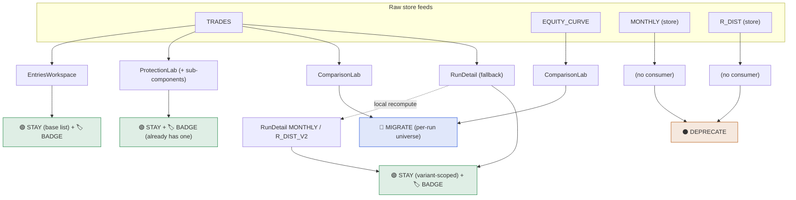

# Trade Universe — Raw-Feed Consumer Migration Map

**Mode:** AUDIT ONLY. No files modified. No implementation.
**Date:** 2026-05-29
**Scope:** Every remaining *direct* consumer of the four baseline/variant-scoped store feeds — `TRADES`, `EQUITY_CURVE`, `MONTHLY`, `R_DIST` — with a disposition for each: **migrate**, **stay baseline-only**, **add baseline scope badge**, or **deprecate**.
**Companion:** `SCENARIO_AWARE_ANALYTICS_AUDIT.md` §5 (this is the focused, standalone migration map for that section).

---

## 0. Disposition legend

The four dispositions are **not mutually exclusive**. A consumer that legitimately stays on baseline/variant data should *also* get a scope badge so its scope is visible. Only one disposition is exclusive in practice: `MIGRATE` (it moves off the raw feed entirely) and `DEPRECATE` (the feed is removed).

| Code | Meaning |
|------|---------|
| 🔵 **MIGRATE** | Re-point onto `useTradeUniverse(runId, scenario)`; the surface should recompute per active universe. |
| 🟢 **STAY** | Keep reading the raw/variant feed — its scope is intentionally *not* the active universe. |
| 🏷️ **BADGE** | Add a `TradeUniverseBadge` (or variant/parameter scope chip) so the surface declares its scope. Pairs with STAY or MIGRATE. |
| ⚫ **DEPRECATE** | Feed has no live consumer — remove after confirming no dynamic access. |

---

## 1. Direct-consumer inventory (verified)

Grep-verified complete set of direct reads of each feed (excluding the `mock.js` fixtures and the store's own definitions):

| Feed | Direct consumers (file · line) |
|------|--------------------------------|
| `TRADES` | EntriesWorkspace L44–45 · ProtectionLab L85–86 · ComparisonLab L34, L63 · RunDetail L238 (+ L352 *fallback only*) |
| `EQUITY_CURVE` | ComparisonLab L64, L83, L99 **(only consumer)** |
| `MONTHLY` | store.js L950 *(no external reads)* · RunDetail L654 *(local recompute, not the store feed)* |
| `R_DIST` | store.js L951 *(no external reads)* · RunDetail L860 `R_DIST_V2` *(local recompute, not the store feed)* |

Downstream note: the ProtectionLab sub-components (`ProtectionDataQualityPanel`, `PenetrationSensitivity`, `StreakVisualiser`, `ObCharacteristicBreakdown`, `TradeLifecycleFlow`) receive `trades` as **props from ProtectionLab**, so they inherit ProtectionLab's baseline-only disposition — they are not independent consumers.

---

## 2. The migration map

---

## 3. Per-consumer disposition

### `TRADES`

**ComparisonLab** (L34, `computeProfitFactor(TRADES)` L63) — 🔵 **MIGRATE**
Intentionally baseline-only today (Phase 3B-3 contract) but it is the one surface that *should* become scenario-aware. Re-point to per-run `useTradeUniverse(runId, slotScenario)` (the resolver already supports the `(runId, scenarioOverride)` signature). Replace the `TRADES`/`EQUITY_CURVE` reads with each run slot's resolved universe; render a per-run badge with `NO_TRADES_FOR_SCENARIO` fallback. Full design in `SCENARIO_AWARE_ANALYTICS_AUDIT.md` §6. *Does not need a separate baseline badge — it gets per-run universe badges as part of the migration.*

**ProtectionLab** (L85–86, + sub-components via props) — 🟢 **STAY** + 🏷️ **BADGE (already present)**
Protection analysis is *defined against the unprotected baseline* — that is the page's purpose (it asks "what would protection rules have done to the baseline trade set?"). Migrating it would make the reference set move under the user, which is wrong. It already resolves a `baselineUniverse` override purely to render the badge; keep that. No change needed beyond confirming the badge stays visible.

**EntriesWorkspace** (L44–45) — 🟢 **STAY (base list)** + 🏷️ **BADGE (currently missing)**
Reads raw `TRADES` as the base list for global filters and "exact rows," then compares entry *models* via `tradesByMode` (its own multi-universe axis). The base list being baseline is defensible — the page exists to compare models against a fixed reference. **Gap:** the page has *no scope badge*, so a user can't tell the base list is baseline while model columns span models. Add a badge clarifying "base list = baseline; columns = per-entry-model." Decide deliberately whether the base list should follow the active universe (low value — recommend leaving baseline as a fixed reference).

**RunDetail** (L238 destructure; L352 `isActiveRun ? TRADES : null`) — 🟢 **STAY (variant-scoped)** + 🏷️ **BADGE**
`TRADES` here is only a *fallback* for the active run when `runData` is absent; the primary source is `tradesForRun` (the selected variant). RunDetail is a single-run execution view and should remain variant-scoped. It needs a badge so its KPIs aren't misread as the active *scenario* (variant ≠ universe).

### `EQUITY_CURVE`

**ComparisonLab** (L64, L83 skeleton, L99 dep) — 🔵 **MIGRATE**
The *only* consumer of this feed outside the store. Migrates with ComparisonLab (above): under a non-baseline universe there is no precomputed equity artifact, so derive a cumulative-R curve from the resolved `universe.trades` (label it Raw-R until the Results-Basis work lands). **Consequence:** once ComparisonLab migrates, `store.EQUITY_CURVE` has *zero* remaining direct readers and is itself a deprecation candidate (low priority — harmless to keep, no longer load-bearing).

### `MONTHLY`

**store-level `MONTHLY`** (`computeMonthly(activeTrades)`, store.js L950) — ⚫ **DEPRECATE**
Grep-confirmed **no external consumers**. RunDetail computes its own monthly from `tradesForRun`. This is dead derived state — remove after confirming no dynamic/string access.

**RunDetail local `MONTHLY`** (L654, from `tradesForRun`) — 🟢 **STAY (variant-scoped)** + 🏷️ **BADGE (inherits RunDetail's)**
Correct as a variant-scoped execution view; rides the page-level RunDetail scope badge. Not a store-feed consumer.

### `R_DIST`

**store-level `R_DIST`** (`computeRDist(activeTrades)`, store.js L951) — ⚫ **DEPRECATE**
Identical situation to `MONTHLY`: no external consumers; RunDetail builds its own `R_DIST_V2`. Dead derived state — remove.

**RunDetail `R_DIST_V2`** (L860, from `tradesForRun`) — 🟢 **STAY (variant-scoped)** + 🏷️ **BADGE (inherits RunDetail's)**
Correct as variant-scoped; rides RunDetail's badge. Not a store-feed consumer.

---

## 4. Summary table

| Feed | Consumer | MIGRATE | STAY | BADGE | DEPRECATE |
|------|----------|:------:|:----:|:-----:|:---------:|
| TRADES | ComparisonLab | ✅ | | (per-run) | |
| TRADES | ProtectionLab (+subs) | | ✅ | ✅ (have) | |
| TRADES | EntriesWorkspace | | ✅ | ✅ (add) | |
| TRADES | RunDetail (fallback) | | ✅ | ✅ (add) | |
| EQUITY_CURVE | ComparisonLab | ✅ | | (per-run) | |
| EQUITY_CURVE | *store feed after migration* | | | | ⚠️ candidate |
| MONTHLY | store-level | | | | ✅ |
| MONTHLY | RunDetail (local) | | ✅ | ✅ (inherit) | |
| R_DIST | store-level | | | | ✅ |
| R_DIST | RunDetail (`R_DIST_V2`) | | ✅ | ✅ (inherit) | |

**Tally:** 1 surface to migrate (ComparisonLab, covering both its `TRADES` and `EQUITY_CURVE` reads) · 3 to badge-and-keep (ProtectionLab, EntriesWorkspace, RunDetail) · 2 store feeds to deprecate (`MONTHLY`, `R_DIST`) + 1 deprecation candidate after migration (`EQUITY_CURVE`).

---

## 5. Recommended sequence

1. 🏷️ **Badge pass first (zero risk).** Add scope badges to EntriesWorkspace and RunDetail; confirm ProtectionLab's stays visible. This resolves the "invisible scope" risk for everything that legitimately stays baseline/variant — most of the value, none of the calculation risk.
2. ⚫ **Deprecate dead feeds.** Remove `store.MONTHLY` and `store.R_DIST` after a dynamic-access check. Pure cleanup; shrinks the consumer surface to its real members.
3. 🔵 **Migrate ComparisonLab.** The only true migration — moves both `TRADES` and `EQUITY_CURVE` reads onto per-run universe resolution (see `SCENARIO_AWARE_ANALYTICS_AUDIT.md` §6). After it lands, re-evaluate `store.EQUITY_CURVE` for deprecation.

---

### STOP — consumer audit & migration map complete. No implementation performed.
